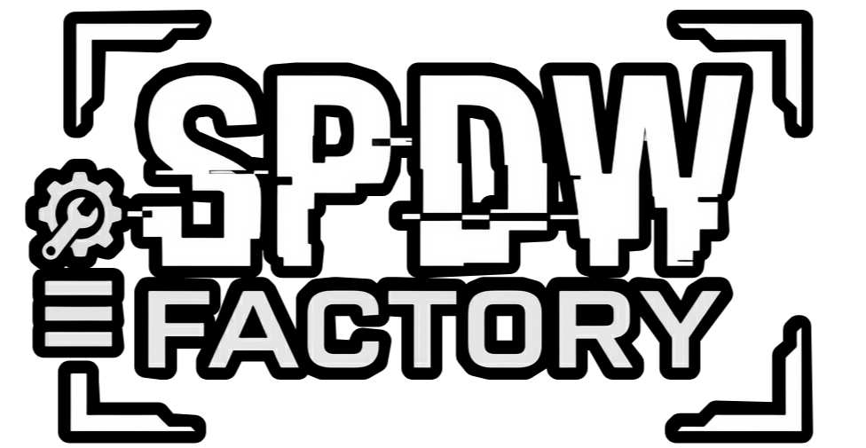
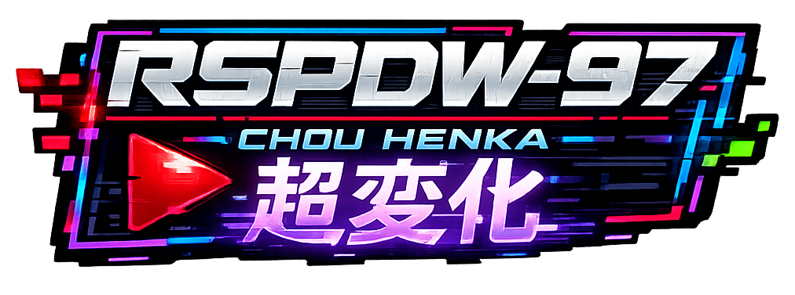

<div align="center"><!-- APP ICON --># SPDW Mappolo### *RetroFW 2.3 Hardware Key Mapper & Diagnostic Utility*Version
Python
Platform
**Developed by SPDW Factory for the RSPDW Chou Henka Project**<!-- SPDW FACTORY LOGO --></div>## ENGLISH### Overview**SPDW Mappolo** (MAPP-0-LO) is the ultimate hardware key mapping, diagnostics, and identification tool built specifically for handheld consoles running **RetroFW 2.3** (RS-97, LDK, RG-300, etc.).By listening to real-time hardware signals and raw input loops, it eliminates development guesswork during engine ports and homebrew compiles. It logs complete keyboard, scancode, modifier, and joystick structures with zero input cooldown.> *"Know yourself to know your enemy."* — Official system comment from default.retrofw.desktop.> <!-- RSPDW LOGO --><div align="center"></div>### Features| Feature | Description ||---|---|| **Zero Cooldown Map** | Instantly captures raw input events on press and release without delays || **Deep Data Logging** | Captures key_id, key_hex, key_name, scancode, unicode, and modifiers (mod) || **Joystick Listener** | Fully parses analog axis motion, hats, buttons, and native device inputs || **Interactive Data Map** | Scrollable index table showcasing active map records and detecting duplicate conflicts || **Dynamic Remapping** | Overwrite, clear, or tweak single-key maps dynamically from the Detail screen || **Automatic Logging** | Compiles and writes clean text-based auto-export summaries to storage upon map completion || **3 Cyber-Retro Themes** | Fully adjustable UI presets: Phantom (Teal), Matrix (Green), and Amber (Orange) || **Configurable UI Elements** | Show or hide keycodes, scancodes, joystick markers, and font sizing on the fly |### Screenshots<!-- SCREENSHOT 1 PLACEHOLDER --><!--  --><p><em>Main Menu — Phantom Theme loaded on RS-97 boot</em></p><!-- SCREENSHOT 2 PLACEHOLDER --><!--  --><p><em>Active real-time keypress listener capture interface</em></p><!-- SCREENSHOT 3 PLACEHOLDER --><!--  --><p><em>Scrollable Data Map inspecting registered scancodes and shared key warning tags</em></p>### Controls```text┌─────────────────────────────────────────────────────────┐│  DPAD        → Navigate menus / scroll table indexes    ││  A (CTRL)    → Confirm / Select / View Detail / Remap   ││  B (ALT)     → Back / Skip Target Button / Cancel       ││  Y (SHIFT)   → Delete map profile (in Data Map Screen)  ││  L (TAB)     → Previous Key Detail Sheet (Detail View)  ││  R (SHIFT)   → Next Key Detail Sheet (Detail View)      ││  SELECT      → Instantly return to Main Menu            │└─────────────────────────────────────────────────────────┘
```### Menu Options * **Let's Map!** — Start or overwrite the full console button map suite sequentially. * **Data Map** — Interactive index grid of key bindings. Features a detailed sub-inspector, raw event logs, and live single-key overwrites. * **Settings** — UI scaling, visibility, system logs, and color theme configurations. * **About** — Application version, design credits, and factory info. * **Exit** — Close and exit cleanly to RetroFW launcher.### Installation#### Method 1: OPK Packaging (Recommended)Compile using your local toolchain or terminal:```bashmksquashfs mappolo_v4/ spdw_mappolo_v4.opk -all-root -noappendcp spdw_mappolo_v4.opk /media/data/apps/
```#### Method 2: Manual Installation via SandboxCreate directories and manually load the scripts:```bashmkdir -p /home/retrofw/rspdw_lab/black_boxmkdir -p /home/retrofw/rspdw_lab/iconscp launcher.sh main.py mappolo_engine.py /home/retrofw/rspdw_lab/chmod +x /home/retrofw/rspdw_lab/launcher.shsh /home/retrofw/rspdw_lab/launcher.sh
```### File Structure```textmappolo_v4/├── main.py                    # Core mapping app & state-machine (Python 2.7)├── mappolo_engine.py          # Pygame drawing system, theme presets, assets├── launcher.sh                # Executable startup shell script├── default.retrofw.desktop    # OPK desktop menu launcher metadata├── icon.png                   # App branding graphic (128x128 & scaled variants)└── README.md                  # This file
```### JSON ConfigurationsThe application writes configuration and runtime outputs directly to the RetroFW developer sandbox environment for persistent loading.#### App Settings FileLocated at: /home/retrofw/rspdw_lab/settings_mappolo.json```json{  "theme": "phantom",  "font_size": 1,  "audio_enabled": true,  "show_scancode": true,  "show_keycode": true,  "show_event_type": true,  "show_joy_details": true,  "version": "4.0",  "auto_save_log": true}
```| Field | Type | Default | Description ||---|---|---|---|| theme | string | "phantom" | Interface layout theme (phantom, matrix, amber) || font_size | int | 1 | Base screen font scale factor (0=Small, 1=Medium, 2=Large) || audio_enabled | bool | true | Enable buzzer feedback signals || show_scancode | bool | true | Display hardware raw scancodes in lists || show_keycode | bool | true | Display numeric ASCII mapping identifiers || show_event_type | bool | true | Display Pygame constant categories (KEYDOWN/KEYUP) || show_joy_details | bool | true | Print detailed axis coordinates and joystick data || auto_save_log | bool | true | Automatically export .log reports upon completion |#### Mapping Output DatabaseLocated at: /home/retrofw/rspdw_lab/black_box/mappolo_data.json```json{  "BTN_A": {    "press": {      "type": 2,      "type_name": "KEYDOWN",      "key": 306,      "key_name": "LCTRL",      "mod": 64,      "scancode": 29,      "unicode": ""    },    "release": {      "type": 3,      "type_name": "KEYUP",      "key": 306,      "key_name": "LCTRL",      "mod": 0,      "scancode": 29,      "unicode": ""    },    "raw_events": [      {"type": 2, "key": 306, "mod": 64, "scancode": 29}    ],    "timestamp": "2026-06-19 14:32:00"  }}
```### Themes| Name | Palette | Vibe ||---|---|---|| **Phantom** | Teal / Pink / Deep Indigo | Neo-Cyberpunk terminal || **Matrix** | High-Bright Green / Dark Void | Classic hacker screen || **Amber** | Orange / Gold / Warm Charcoal | Warm CRT phosphor monitor |### Requirements * **Device**: RS-97, RG-300, LDK, or similar RetroFW 2.3 system * **Interpreter**: Python 2.7 (included in system runtime) * **Pygame**: Compiled with FBcon (Framebuffer console) support * **Directory Permissions**: Read/Write access allowed on /home/retrofw/### Troubleshooting| Issue | Solution ||---|---|| **Display crashes / black screen** | Ensure launcher.sh specifies export SDL_VIDEODRIVER=fbcon before running Python. || **Settings not loading / resetting** | Delete /home/retrofw/rspdw_lab/settings_mappolo.json and relaunch to recreate defaults. || **No icons render in footer** | Ensure icon package is located in /home/retrofw/rspdw_lab/icons/. || **Application fails to run** | Run chmod +x launcher.sh from the console to fix execution bounds. |### Changelog#### v4.0 (2026-06-19) * **Instant Capture Mode:** Eliminated cooldown delays between mapping inputs. * **Data Map Upgrades:** Added live table rendering, scroll metrics, and duplicate overlap warnings. * **Detail Navigation:** Implemented dynamic key sub-inspector sheets with L/R trigger navigation (TAB/LSHIFT). * **Graphic Legends:** Replaced text prompts with pixel art icons for clean layout diagnostics. * **Color Calibration:** Improved readability of selected text menus within the Settings screens across all themes. * **Auto-Saves:** Configured automated export of debug profiles to /home/retrofw/rspdw_lab/black_box/mappolo_auto.log.#### v2.0 (2026-05) * Multi-theme configuration files. * Pygame Event engine integration. * Hardware Joypad axis calibration setup.## Credits<div align="center"><!-- SPDW SYMBOL -->**SPDW Factory (Sector K)** — Development<!-- MINORU SYMBOL -->**sirpipsduwilson** — Project Lead**Part of "SPDW"** — Crossdimensional Underground Cyberpunk Entertainment Protocol**with the participation of: Minoru^7** — RI (pain in the a**) Protocol<!-- RSPDW LOGO -->*Part of the **RSPDW Chou Henka Project***</div>## License```textSPDW Mappolo v4.0Copyright (c) 2026 SPDW Factory
Free for personal and homebrew development use.Part of the RSPDW Chou Henka Project.
Redistribution and use in source and binary forms, with or withoutmodification, are permitted provided that the copyright and permission notices appear on all copies.
THE SOFTWARE IS PROVIDED "AS IS", WITHOUT WARRANTY OF ANY KIND.
```<div align="center">**⬇ Download Latest Release**** Report Issue**** Discussions***Made with by SPDW Factory for the RetroFW community*</div>
